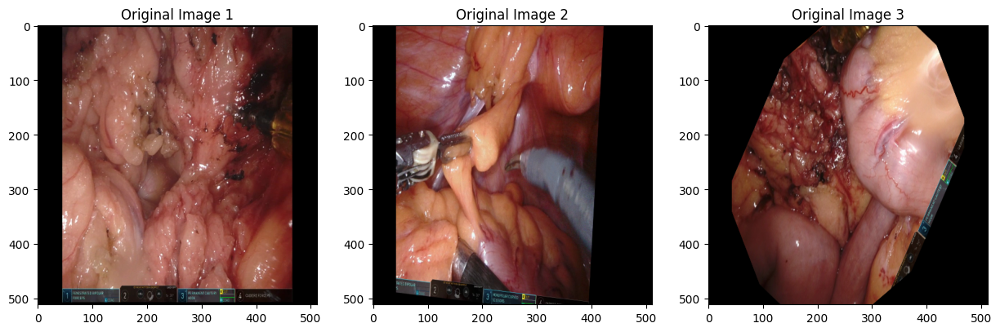
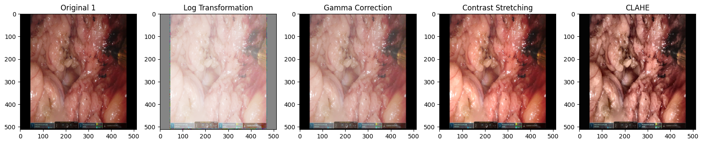
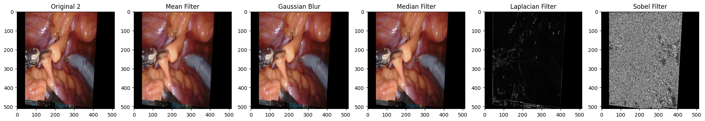

# Dresden Surgical Anatomy Dataset: Preprocessing and YOLO Segmentation

## 📖 Project Overview

This repository focuses on advanced image preprocessing and state-of-the-art object segmentation for the **Dresden Surgical Anatomy Dataset**. The project pipeline includes **intensity transformations**, **image filtering**, and the implementation of **YOLOv8** and **YOLOv12 segmentation models** for precise identification of abdominal organs and structures in laparoscopic surgical videos. The goal is to enhance surgical scene understanding and assist in computer-assisted interventions.

---

## 🏥 Dataset Overview

The **Dresden Surgical Anatomy Dataset** is a comprehensive collection of semantic segmentations for abdominal anatomy as seen in laparoscopic surgery.

### **Key Characteristics**
*   **Source**: 32 real surgical procedures.
*   **Patient Demographics**: Majority male (26/32), average age 63, mean BMI 26.75 kg/m².
*   **Imaging**: Recorded with a Da Vinci® Xi/X 8mm, 30° endoscope at 1920 × 1080 resolution.
*   **Annotations**: **11 anatomical structures** were manually segmented pixel-wise by an experienced annotator using 3D Slicer software.
*   **Scale**: At least 1,000 annotated images per organ/structure, sourced from at least 20 different patients to ensure diversity.

### **Anatomical Structures**
The dataset includes segmentations for:
*   **8 Abdominal Organs**: Colon, Liver, Pancreas, Small Intestine, Spleen, Stomach, Ureter, Vesicular Glands.
*   **Abdominal Wall**
*   **2 Vascular Structures**: Inferior Mesenteric Artery, Intestinal Veins.

**Paper Link:** [The Dresden Surgical Anatomy Dataset](https://www.nature.com/articles/s41597-024-03607-3)

---

## 📂 Dataset Directory Structure

The dataset is prepared in formats compatible with major computer vision frameworks (**YOLO** and **COCO**), with all images resized to **512x512 pixels**.

```
dataset_root/
├── images/                  # All input images
│   ├── train/
│   ├── val/
│   └── test/
├── labels/                  # YOLO-format labels (*.txt files)
│   ├── train/
│   ├── val/
│   └── test/
├── annotations/             # COCO-format JSON files
│   ├── instances_train.json
│   ├── instances_val.json
│   └── instances_test.json
├── masks/                   # Binary segmentation masks
│   ├── train/
│   ├── val/
│   └── test/
├── npz/                     # Masks in NPZ format
│   ├── train/
│   ├── val/
│   └── test/
└── dataset.yaml            # YOLO dataset configuration file
```

---

## 🛠️ Technical Pipeline & Notebooks

The project workflow is implemented across several Kaggle notebooks, covering preprocessing, filtering, and model training.

### **Interactive Notebook Table**

<table style="width:100%; border-collapse: collapse; font-family: 'Segoe UI', Arial, sans-serif; border-radius: 12px; overflow: hidden; box-shadow: 0 8px 25px rgba(0, 0, 0, 0.1);">
<thead style="background: linear-gradient(135deg, #434343 0%, #000000 100%); color: white;">
<tr>
<th style="padding: 18px 15px; text-align: center; font-weight: 700; font-size: 1.1em; border-right: 1px solid rgba(255,255,255,0.2);">Step</th>
<th style="padding: 18px 15px; text-align: center; font-weight: 700; font-size: 1.1em; border-right: 1px solid rgba(255,255,255,0.2);">Notebook</th>
<th style="padding: 18px 15px; text-align: center; font-weight: 700; font-size: 1.1em; border-right: 1px solid rgba(255,255,255,0.2);">Description</th>
<th style="padding: 18px 15px; text-align: center; font-weight: 700; font-size: 1.1em;">Link</th>
</tr>
</thead>
<tbody>
<tr style="background: linear-gradient(135deg, #f8f9fa 0%, #e9ecef 100%);">
<td style="padding: 16px 15px; text-align: center; font-weight: 700; color: #212529; border-bottom: 1px solid #dee2e6; border-right: 1px solid #dee2e6;">1️⃣</td>
<td style="padding: 16px 15px; font-weight: 600; color: #2c3e50; border-bottom: 1px solid #dee2e6; border-right: 1px solid #dee2e6;">Data Preview & Intensity Transformation</td>
<td style="padding: 16px 15px; color: #495057; border-bottom: 1px solid #dee2e6; border-right: 1px solid #dee2e6;">Visualizes original data and applies contrast enhancement techniques.</td>
<td style="padding: 16px 15px; text-align: center; border-bottom: 1px solid #dee2e6;">
<a href="https://www.kaggle.com/code/asfarhossainsitab/cse438-assignment01-group-j-intensity-transformati" style="background: linear-gradient(90deg, #6c757d, #495057); color: white; padding: 8px 18px; border-radius: 25px; text-decoration: none; font-weight: 600; display: inline-block; transition: all 0.3s ease; box-shadow: 0 4px 8px rgba(108, 117, 125, 0.2);" onmouseover="this.style.transform='translateY(-2px)';this.style.boxShadow='0 6px 12px rgba(108, 117, 125, 0.3)';" onmouseout="this.style.transform='translateY(0)';this.style.boxShadow='0 4px 8px rgba(108, 117, 125, 0.2)';">Kaggle</a>
</td>
</tr>
<tr style="background: linear-gradient(135deg, #e3f2fd 0%, #bbdefb 100%);">
<td style="padding: 16px 15px; text-align: center; font-weight: 700; color: #0d47a1; border-bottom: 1px solid #90caf9; border-right: 1px solid #90caf9;">2️⃣</td>
<td style="padding: 16px 15px; font-weight: 600; color: #1565c0; border-bottom: 1px solid #90caf9; border-right: 1px solid #90caf9;">Image Filtering</td>
<td style="padding: 16px 15px; color: #1976d2; border-bottom: 1px solid #90caf9; border-right: 1px solid #90caf9;">Applies spatial filters (e.g., Gaussian, Median) to reduce noise and enhance edges.</td>
<td style="padding: 16px 15px; text-align: center; border-bottom: 1px solid #90caf9;">
<a href="https://www.kaggle.com/code/asfarhossainsitab/cse438-assignment01-group-j-intensity-transformati" style="background: linear-gradient(90deg, #2196f3, #0d47a1); color: white; padding: 8px 18px; border-radius: 25px; text-decoration: none; font-weight: 600; display: inline-block; transition: all 0.3s ease; box-shadow: 0 4px 8px rgba(33, 150, 243, 0.2);" onmouseover="this.style.transform='translateY(-2px)';this.style.boxShadow='0 6px 12px rgba(33, 150, 243, 0.3)';" onmouseout="this.style.transform='translateY(0)';this.style.boxShadow='0 4px 8px rgba(33, 150, 243, 0.2)';">Kaggle</a>
</td>
</tr>
<tr style="background: linear-gradient(135deg, #e8f5e9 0%, #c8e6c9 100%);">
<td style="padding: 16px 15px; text-align: center; font-weight: 700; color: #1b5e20; border-bottom: 1px solid #a5d6a7; border-right: 1px solid #a5d6a7;">3️⃣</td>
<td style="padding: 16px 15px; font-weight: 600; color: #2e7d32; border-bottom: 1px solid #a5d6a7; border-right: 1px solid #a5d6a7;">YOLOv8 Segmentation</td>
<td style="padding: 16px 15px; color: #388e3c; border-bottom: 1px solid #a5d6a7; border-right: 1px solid #a5d6a7;">Trains a YOLOv8 model for instance segmentation of anatomical structures.</td>
<td style="padding: 16px 15px; text-align: center; border-bottom: 1px solid #a5d6a7;">
<a href="https://www.kaggle.com/code/asfarhossainsitab/cse438-assignment01-group-no-j-yolov8seg" style="background: linear-gradient(90deg, #4caf50, #1b5e20); color: white; padding: 8px 18px; border-radius: 25px; text-decoration: none; font-weight: 600; display: inline-block; transition: all 0.3s ease; box-shadow: 0 4px 8px rgba(76, 175, 80, 0.2);" onmouseover="this.style.transform='translateY(-2px)';this.style.boxShadow='0 6px 12px rgba(76, 175, 80, 0.3)';" onmouseout="this.style.transform='translateY(0)';this.style.boxShadow='0 4px 8px rgba(76, 175, 80, 0.2)';">Kaggle</a>
</td>
</tr>
<tr style="background: linear-gradient(135deg, #fce4ec 0%, #f8bbd9 100%);">
<td style="padding: 16px 15px; text-align: center; font-weight: 700; color: #880e4f; border-bottom: 1px solid #f48fb1; border-right: 1px solid #f48fb1;">4️⃣</td>
<td style="padding: 16px 15px; font-weight: 600; color: #ad1457; border-bottom: 1px solid #f48fb1; border-right: 1px solid #f48fb1;">YOLOv12 Segmentation</td>
<td style="padding: 16px 15px; color: #c2185b; border-bottom: 1px solid #f48fb1; border-right: 1px solid #f48fb1;">Implements the latest YOLOv12 model for high-accuracy segmentation tasks.</td>
<td style="padding: 16px 15px; text-align: center; border-bottom: 1px solid #f48fb1;">
<a href="https://www.kaggle.com/code/asfarhossainsitab/cse438-assignment01-group-no-j-yolov12" style="background: linear-gradient(90deg, #e91e63, #880e4f); color: white; padding: 8px 18px; border-radius: 25px; text-decoration: none; font-weight: 600; display: inline-block; transition: all 0.3s ease; box-shadow: 0 4px 8px rgba(233, 30, 99, 0.2);" onmouseover="this.style.transform='translateY(-2px)';this.style.boxShadow='0 6px 12px rgba(233, 30, 99, 0.3)';" onmouseout="this.style.transform='translateY(0)';this.style.boxShadow='0 4px 8px rgba(233, 30, 99, 0.2)';">Kaggle</a>
</td>
</tr>
</tbody>
</table>

> **Note:** The link for the "CSE438 Assignment01_Group no_J_YOLOv11 seg" notebook returned a 404 error and is not included in the active pipeline.

---

## 🖼️ Visual Pipeline Preview

### **1. Original Dataset Image**

*Example of a raw laparoscopic frame from the dataset, showing the complex abdominal surgical scene.*

### **2. Intensity Transformation**

*Result after applying contrast enhancement and histogram equalization to improve tissue differentiation and visibility of anatomical details.*

### **3. Image Filtering**

*Output after applying a smoothing filter (e.g., Gaussian) to reduce surgical noise like specular highlights or blood, preparing the image for segmentation.*

---

## 🚀 Model Training & Evaluation

*   **Frameworks**: Implemented using **Ultralytics YOLO**.
*   **Hardware**: Trained on **Kaggle GPU (T4 x2)**.
*   **Key Task**: **Instance Segmentation** – predicting both bounding boxes and pixel-wise masks for each anatomical structure.
*   **Typical Runtime**: ~1 hour 12 minutes for YOLOv12 training.

### **Expected Workflow**
1.  **Preprocess** images using the transformation and filtering notebooks.
2.  **Configure** the `dataset.yaml` file to point to your train/val/test splits.
3.  **Train** a model using either the YOLOv8 or YOLOv12 notebook.
4.  **Evaluate** model performance using standard metrics (mAP, precision, recall) on the test set.

---

## 👥 Authors
1.  **Asfar Hossain Sitab**
2.  **Parmita Hossain Simia**


---

## 📜 License
This project is released under the **Apache 2.0** open source license. The dataset is intended for academic and research purposes.
